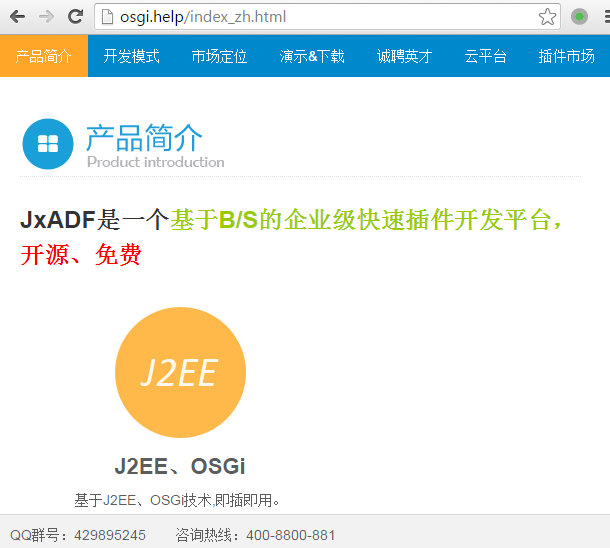
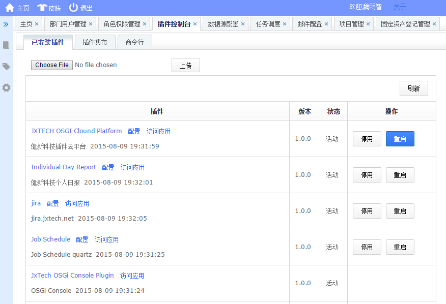
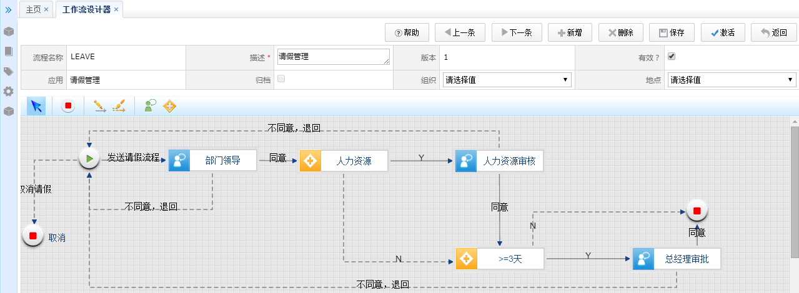
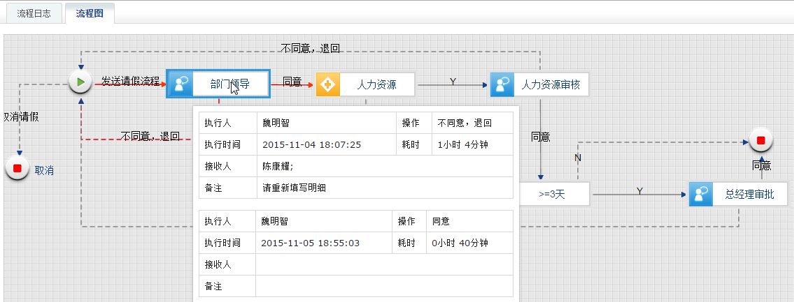



OSGi联盟(OSGi Alliance)官网：http://osgia.com

<a href="http://osgia.com" target="osgi">插件化（OSGi）开源快速开发平台JXADF功能特点</a>：

1、基于OSGi、J2EE

2、插件集市 http://osgia.com/jxweb/pluginstore/index.action 中有丰富的插件。

3、前端代码（界面、CSS、JS、图片等）、后端代码（JAVA业务逻辑、SQL脚本【只需要提供一种数据库脚本，在安装时会根据数据库类型自动转换】）全部打包在一个Bundle（JAR）中，分发、测试、积累、部署都十分方便。

4、支持热部署、多数据库(Oracle\MySQL\MS SQLServer)、换肤、国际化等。

5、支持多种工流引擎，包括：健新科技自己研发的工作流引擎、Activiti、Oracle BPM，可根据需要集成自己的工作流引擎。

6、桌面端、移动端自适应，采用模板技术，开发一次，解析为桌面、手机、平板前端界面。

7、学习成本低、效率高。

8、有丰富的文档，参见：http://wiki.osgi.help/display/JXADF/Home

9、演示地址：http://demo.osgi.help 用户名：admin 密码：123456

------------------------------------
官网：http://osgia.com
QQ群：429895245

如果喜欢,请加颗星,

如果有建议,请加QQ告诉我们，

如果不喜欢，也请告诉我们，以便我们改进。

---------------------------------------------------
插件控制台
======

工作流
=======

工作流更多 http://wiki.osgi.help/pages/viewpage.action?pageId=22054753

移动端自适效果图
=======

编译好的执行程序下载
========
http://osgia.com

微信号: wmzsoft
https://gratipay.com/~wmzsoft

